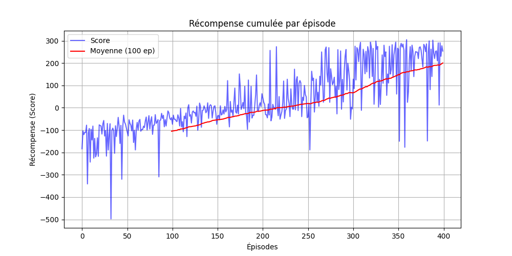
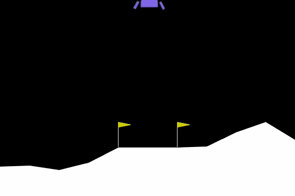
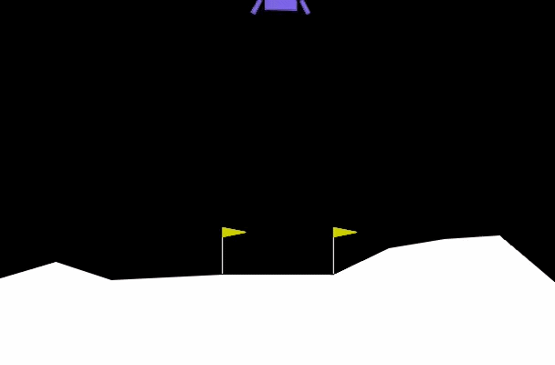

<div align="center">

```
    ██╗     ██╗   ██╗███╗   ██╗ █████╗ ██████╗     ██╗      █████╗ ███╗   ██╗██████╗ ███████╗██████╗
    ██║     ██║   ██║████╗  ██║██╔══██╗██╔══██╗    ██║     ██╔══██╗████╗  ██║██╔══██╗██╔════╝██╔══██╗
    ██║     ██║   ██║██╔██╗ ██║███████║██████╔╝    ██║     ███████║██╔██╗ ██║██║  ██║█████╗  ██████╔╝
    ██║     ██║   ██║██║╚██╗██║██╔══██║██╔══██╗    ██║     ██╔══██║██║╚██╗██║██║  ██║██╔══╝  ██╔══██╗
    ███████╗╚██████╔╝██║ ╚████║██║  ██║██║  ██║    ███████╗██║  ██║██║ ╚████║██████╔╝███████╗██║  ██║
    ╚══════╝ ╚═════╝ ╚═╝  ╚═══╝╚═╝  ╚═╝╚═╝  ╚═╝   ╚══════╝╚═╝  ╚═╝╚═╝  ╚═══╝╚═════╝ ╚══════╝╚═╝  ╚═╝
```

### `< Reinforcement Learning — Epitech G-AIA-401 />`

**Train an autonomous agent to land a lunar module on the Moon.**
**No pilot. No mercy. Just math.**

---


</div>

---

## 🌕 The Mission

You are part of one of the first teams exploring our solar system. **Destination: Mars.**

Before sending humans across space, a relay base must be established on the Moon.
You can't afford to put a pilot in every lunar module — so you'll train one to land itself.

The agent learns by **trial and error** from sparse rewards.
It will crash. A lot. Then one day, it won't.

---

## ⚡ Quick Start

```bash
git clone <repo-url>
cd <repo>

# Setup using launch script
./launch.sh
```

Or manually:
```bash
python3 -m venv venv
source venv/bin/activate
pip install -r requirements.txt # (or see launch.sh for pip commands)

# Run training
python src/train.py --config configs/base_random.yaml
python src/train.py --config configs/base_heuristic.yaml
python src/train.py --config configs/dqn_test.yaml

# Run evaluation
python src/eval.py --config configs/dqn_test.yaml
```

---

## 📁 Project Structure

```text
.
├── 🚀 launch.sh                    # Setup and quick launch script
├── 🔁 reproduce.py                 # Script to reproduce results on 5 seeds
├── problemes.txt                   # Notes and known issues during dev
│
├── configs/
│   ├── base_random.yaml            # Random policy config
│   ├── base_heuristic.yaml         # Heuristic policy config
│   ├── dqn_test.yaml               # DQN agent test config
│   └── base_dqn.yaml               # DQN base base config
│
├── doc/
│   └── AGENT.ipynb                 # Documentation and analysis
│
├── src/
│   ├── train.py                    # Training entry point
│   ├── eval.py                     # Evaluation entry point
│   ├── env_utils.py                # Gymnasium wrapper + termination detection
│   ├── logger.py                   # Episode logger → CSV + plots + terminal
│   ├── policies.py                 # Random & Heuristic baselines
│   └── lunarAI.py                  # DQN agent (PyTorch)
│
├── logs/                           # CSV logs and model weights (.pth) (auto-created)
└── videos/                         # Recorded episodes for key milestones
```

---

## 🌍 Environment — LunarLander-v3

> A 2D rocket landing task built on Box2D physics.

### State — 8D observation vector

| # | Variable | Description |
|---|---|---|
| 0 | `x` | Horizontal position (0 = center) |
| 1 | `y` | Vertical position (0 = ground) |
| 2 | `vx` | Horizontal velocity |
| 3 | `vy` | Vertical velocity (negative = falling) |
| 4 | `theta` | Lander angle (0 = upright) |
| 5 | `theta_dot` | Angular velocity |
| 6 | `leg_left` | Left leg ground contact (0 or 1) |
| 7 | `leg_right` | Right leg ground contact (0 or 1) |

### Actions — Discrete

| Action | Effect |
|---|---|
| `0` | Do nothing |
| `1` | Fire left thruster |
| `2` | Fire main engine (thrust up) |
| `3` | Fire right thruster |

### Reward Shaping

| Event | Reward |
|---|---|
| Close to landing pad | `+` |
| Moving slowly | `+` |
| Staying level | `+` |
| Both legs touching | `+` |
| Engine firing | small `-` per step |
| Safe landing | **+100** |
| Crash | **-100** |

> ✅ **Solved** when mean score ≥ 200 over 100 consecutive episodes.

---

## 🧠 Architecture

```text
src/train.py  ────────────────────────────────────────────────────────
  │
  ├── make_env(cfg)               # env_utils.py
  │     └── LunarLander-v3       # Gymnasium + Box2D
  │
  ├── EpisodeLogger(csv_path)     # logger.py
  │     └── logs every episode → CSV + terminal + Generates plots!
  │
  └── policy.select_action(obs)   # policies.py / lunarAI.py
        │
        └── env.step(action)
              │
              └── get_termination_reason()   # env_utils.py
                    └── log_episode(reason)
```

---

## 📊 Termination Reasons

Every episode is logged with a cause — critical for debugging the agent.

| Reason | Icon | Meaning |
|---|---|---|
| `landing` | ✅ | Both legs down, low speed, level angle |
| `crash` | 💥 | Hull hit the ground |
| `out_of_view` | 🚀 | Lander flew off-screen |
| `sleep` | 💤 | Step limit reached (truncated) |

---



---

## 📈 Baselines & DQN Progress

| Policy | Mean Score | Notes |
|---|---|---|
| Random | ~-165 | Pure chaos, crashes every time |
| Heuristic | ~TBD | Rule-based, no learning |
| DQN | ≥ 200 | Target — solves the environment |

### 🛠️ Key Improvements & Development Notes
- **Dynamic configurations:** The DQN agent (`lunarAI.py`) parses parameters directly from YAML configuration files.
- **Evaluation Scripts:** `eval.py` strictly exploits the policy without any random actions from epsilon decay, verifying true learning progress across saved `.pth` seed model files.
- **Visual logging:** Plot generation has been integrated natively into the training and logging pipelines to chart returns, epsilon decay, and ablation studies perfectly over episode progression.
- **Video optimizations:** Video generation detects important milestones to avoid full-training recording which originally overloaded the system.

---

## 🔁 Reproducibility

All experiments run on **5 seeds (0–4)**. Results reported as **mean ± 95% CI**.

```bash
python reproduce.py
# Regenerates all trainings, evaluations, and plots for all 5 seeds
```

---

## 📦 Requirements

```
gymnasium[box2d] >= 0.29.0
torch            >= 2.0.0
numpy            >= 1.24.0
matplotlib       >= 3.7.0
pyyaml           >= 6.0
```

---

## 👥 Team

| Role | Scope |
|---|---|
| Infra & Baselines | `env_utils`, `logger`, `policies`, `train`, `eval`, configs, README |
| DQN Agent | `agent.py`, replay buffer, target network, epsilon decay, ablations |

---

##  Videos

### Failed (not trained):
<div align="center">
    

</div>

### Succeed (trained):
<div align="center">


</div>

---

<div align="center">

```
   [ EPITECH ]  ·  G-AIA-401  ·  2025
   Shoot for the moon. Land on the moon.
```

</div>